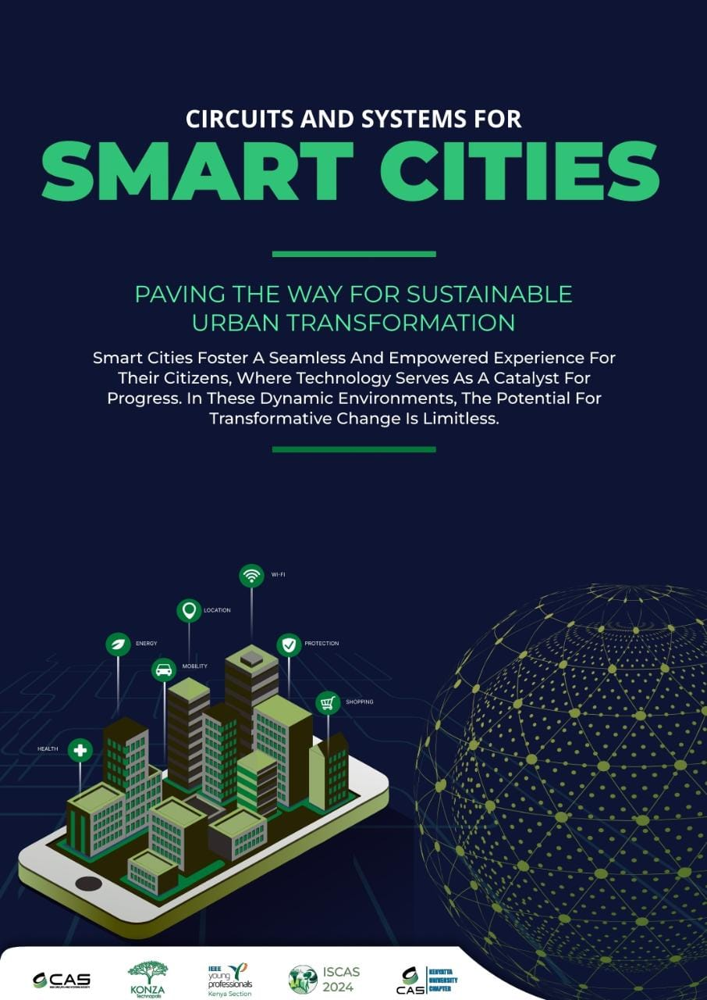

# Smart Cities Workshop Materials
[IEEE Circuits & Systems Society (CASS)](https://ieee-cas.org/) Smart cities workshop resource materials.  
  

  
[Registration](https://events.vtools.ieee.org/m/362961) link

## Partners
- [IEEE Circuits & Systems Kenya Section](https://www.linkedin.com/company/casskenya/?viewAsMember=true)
- [IEEE Young Professionals Kenya Section](https://www.linkedin.com/company/ieeeypkenya/)
- [IEEE CASS Kenyatta University Chapter](https://www.linkedin.com/company/ieee-cass-kenyatta-university/)
- [Konza Technopolis](https://konza.go.ke/)  -A GLOBAL TECHNOLOGY AND INNOVATION HUB
- [IEEE Kenyatta University Student Branch](https://www.linkedin.com/company/ieee-ku-sb/about/)

# IDE Setup 
For this session, we will use Arduno IDE or PlatformIO through the Visual Studio Code. 
## Setting up ESP32 on Arduino IDE
[Follow this link ](https://dronebotworkshop.com/esp32-intro/) to setup ESP32 on Arduino IDE. Once done, select the ESP32 board that corresponds to your board in your Arduino IDE Board Selector

## PlatformIO on Visual Studio Code
- Install VS Code for your PC
- [Follow this guide ](https://docs.platformio.org/en/latest/integration/ide/vscode.html) for a comprehensive installation guide and configuration.
  
> Note: PlatformIO installation may download many libraries depending on your board of choice. Be aware of your respective data consumption rates.
  

# Code Samples
- [Bluetooth Connectivity](./samples/bluetooth.ino)
- [Wifi Connectivity](./samples/wifi.ino)
- [Http Requsts](./samples/httprequests.ino)

# ESP Boards - Reference docs
- [ESP32 Boards](https://docs.espressif.com/projects/esp-idf/en/v4.3/esp32/hw-reference/modules-and-boards.html) - Documentation, datasheets and pinouts
- [NodeMCU ESP32](https://esphome.io/devices/nodemcu_esp32.html)
- [NodeMCU-32S](https://docs.ai-thinker.com/en/esp32/boards/nodemcu_32s) - Core Development Board from Ai-Thinker
- [TTGO® T-Call ESP32 + SIM800L GSM/GPRS Module](https://github.com/Xinyuan-LilyGO/LilyGo-T-Call-SIM800/blob/master/doc/SIM800L_IP5306.MD)